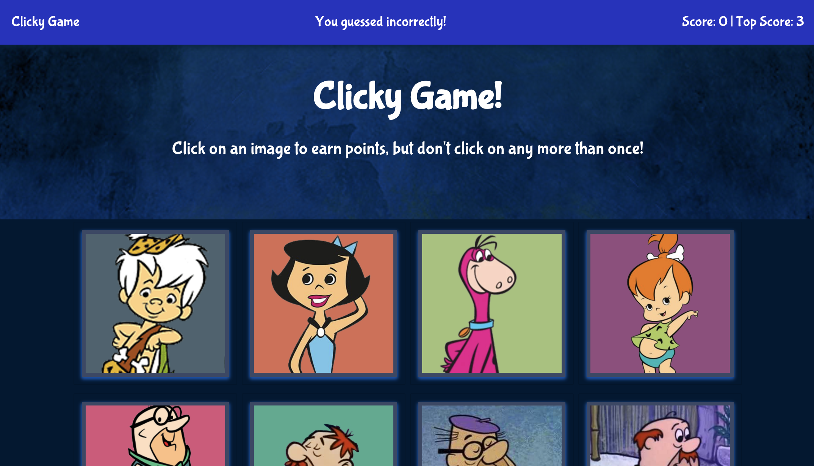

# Clicky
A visual memory-test game built with React.


# Table of contents
- [Clicky](#clicky)
- [Table of contents](#table-of-contents)
  - [Installation](#installation)
  - [Usage](#usage)
  - [Live Demo](#live-demo)
  - [License](#license)
  - [Features](#features)
  - [Technology](#technology)
  - [User Story](#user-story)
  - [Badges](#badges)
<a name="Installation"></a>
## Installation
```sh
npm start
```
<a name="Usage"></a>
## Usage
```sh
npm start
```
<a name="Live_Demo"></a>
## Live Demo
url_here
<a name='License'></a>
## License
[](https://lbesson.mit-license.org/)
<a name="Features"></a>
## Features
1. Dynamically generated components
2.  state management
3.  dependency injection
<a name="Technology"></a>
## Technology
1. React
2.  Bootstrap

<a name="User_Story"></a>
## User Story
```sh
Anyone who wants to test their visual memory will have fun playing this game
```

<a name="Badges"></a>
## Badges
 [](https://shields.io/)

**on github:** <a href='github.com/b0rgBart3'>b0rgBart3</a>

[](https://github.com/remarkablemark)

Email: borgBart3@gmail.com
